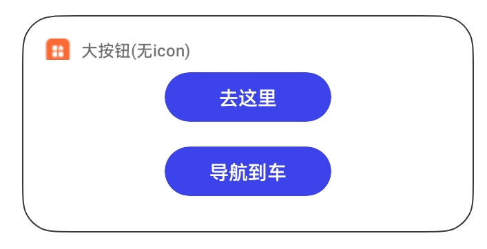
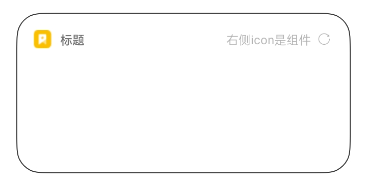
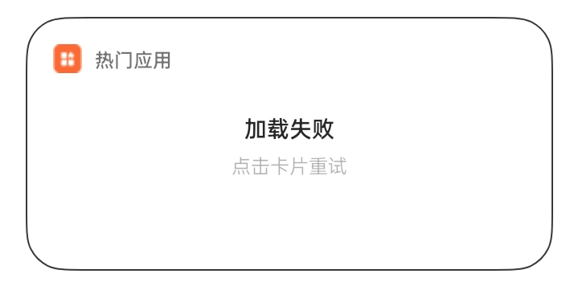
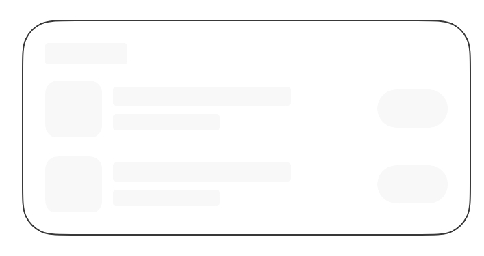

# WidgetUI 组件库项目说明

快应用卡片组件库项目，点击查看[组件库文档](https://github.com/OPPO-QuickApp/widget-ui/blob/dev/docs/button.md)

## 使用方法

考虑卡片样式多样性，目前只支持拷贝组件路径到项目中直接使用，按需拷贝即可，保持源码精简

组件库目录

```sh
src/components/
```

组件库使用了 less 来开发，所以你还需要安装对应依赖。

```sh
npm install less less-loader --save-dev
```

## 特别说明

本组件库的核心组件在：button 按钮组件、error-page 缺省页组件、skeleton 组件、title 标题组件。

若有需求，需要适配桌面环境，可使用：container 容器组件。

icon 组件为辅助组件，不需要可在组件中使用图片代替即可。

开发者可根据自身的需要增加内容或者删减预制内容，保持源码的精简。

## 项目结构

```sh
├── docs  # 组件库文档目录
├── sign  # 组件库sample签名
│   ├── debug
│   └── release
└── src # 组件库项目sample
    ├── common
    ├── components # 组件库具体组件
    │   └── button # 按钮组件
    │   └── container # 容器组件
    │   └── error-page # 缺省页组件
    │   └── icon # icon组件
    │   └── skeleton # 骨架屏组件
    │   └── title # 标题组件
    └── demo # sample页面
    │   ├── button_demo # 按钮demo
    │   └── card_demo # 完整示例demo
    │   └── error_demo # 缺省页demo
    │   └── skeleton_demo # 骨架屏demo
    │   └── title_demo # 标题demo
    └── pages # 快应用页面展示示例
        ├── button # 按钮demo
	...
```

## 开发上手

```shell script
npm install # 安装依赖
npm run dev # 启动文档开发
npm run start # 开启sample编译及调试
```

## 温馨提示

> 组件库默认使用的 designWidth 为 360px,设计稿需严格按照 360px 来设计，否则会布局异常


## 组件示例

### button 按钮组件

<div style="text-align: center;margin: 40px;"></div>

### title 标题组件

<div style="text-align: center;margin: 40px;"></div>

### error 缺省页组件

<div style="text-align: center;margin: 40px;"></div>

### skeleton 骨架屏组件

<div style="text-align: center;margin: 40px;"></div>


## 反馈交流

你在使用卡片组件库的过程中遇到任何问题，欢迎在`github`上给我们提 issue。
