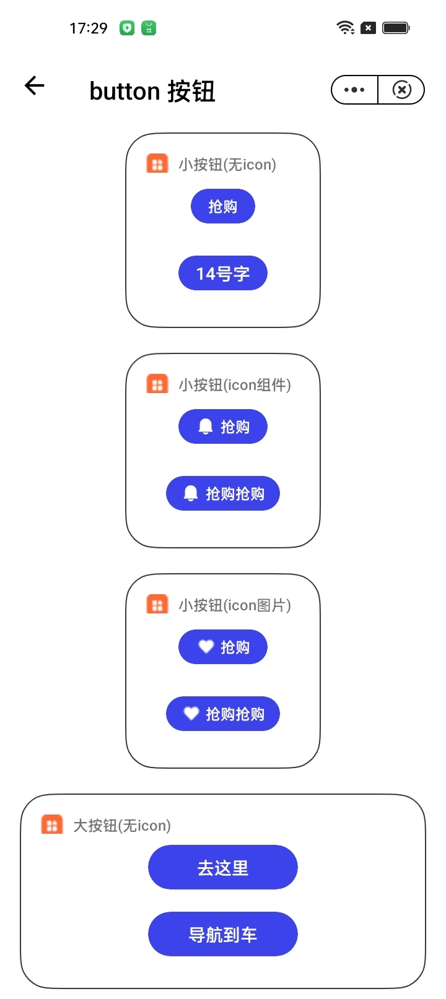

## 按钮 button

### 描述

用于各类业务逻辑场景的基础组件。

### 使用效果

<div style="text-align: center;margin: 40px;"></div>

### 使用方法

在`.ux`文件中引入组件

```html
<import name="widget-button" src="../../components/button/index.ux"></import>
<import name="widget-title" src="../../components/title/index.ux"></import>
<import name="widget-icon" src="../../components/icon/index.ux"></import>
```

### 示例

```html
<template>
  <div class="page">
    <div class="item-container">
      <div class="small-wrapper container">
        <widget-title title="小按钮(无icon)">
          <div class="logo" enablenightmode="false"></div>
        </widget-title>
        <div class="button-wrap">
          <widget-button width="52" @click="click">抢购</widget-button>
          <widget-button width="72" font-size="14">14号字</widget-button>
        </div>
      </div>
    </div>

    <div class="item-container">
      <div class="small-wrapper container">
        <widget-title title="小按钮(icon组件)">
          <div class="logo" enablenightmode="false"></div>
        </widget-title>
        <div class="button-wrap">
          <widget-button width="72" image="{{ image1 }}">抢购</widget-button>
          <widget-button width="92" image="{{ image1 }}"
            >抢购抢购</widget-button
          >
        </div>
      </div>
    </div>

    <div class="item-container">
      <div class="small-wrapper container">
        <widget-title title="小按钮(icon图片)">
          <div class="logo" enablenightmode="false"></div>
        </widget-title>
        <div class="button-wrap">
          <widget-button width="72" image="{{ image2 }}">抢购</widget-button>
          <widget-button width="92" image="{{ image2 }}"
            >抢购抢购</widget-button
          >
        </div>
      </div>
    </div>

    <div class="item-container">
      <div class="medium-wrapper container">
        <widget-title title="大按钮(无icon)">
          <div class="logo" enablenightmode="false"></div>
        </widget-title>
        <div class="button-wrap">
          <widget-button width="121" size="large">去这里</widget-button>
          <widget-button width="121" size="large">导航到车</widget-button>
        </div>
      </div>
    </div>

    <div class="item-container">
      <div class="medium-wrapper container">
        <widget-title title="大按钮(icon组件)">
          <div class="logo" enablenightmode="false"></div>
        </widget-title>
        <div class="button-wrap">
          <widget-button
            width="144"
            image="{{ image3 }}"
            size="large"
            color="rgba(0, 0, 0, 0.85)"
          >
            去这里
          </widget-button>
          <widget-button
            width="144"
            image="{{ image3 }}"
            size="large"
            color="rgba(0, 0, 0, 0.85)"
          >
            导航到车
          </widget-button>
        </div>
      </div>
    </div>

    <div class="item-container">
      <div class="medium-wrapper container">
        <widget-title title="大按钮(icon图片)">
          <div class="logo" enablenightmode="false"></div>
        </widget-title>
        <div class="button-wrap">
          <widget-button
            width="144"
            image="{{ image4 }}"
            size="large"
            color="rgba(0, 0, 0, 0.85)"
          >
            去这里
          </widget-button>
          <widget-button
            width="144"
            image="{{ image4 }}"
            size="large"
            color="rgba(0, 0, 0, 0.85)"
          >
            导航到车
          </widget-button>
        </div>
      </div>
    </div>
  </div>
</template>

<script>
  import love from '../../common/images/love.png'
  import nav from '../../common/images/nav.png'
  import home from '../../common/images/home.svg'

  export default {
    data() {
      return {
        isDark: false,
        image1: {
          iconPath: home,
          icon: {
            type: 'ring-fill',
            color: '#fff',
          },
        },
        image2: {
          iconPath: love,
        },
        image3: {
          icon: {
            type: 'upload-fill',
            color: '#000',
          },
        },
        image4: {
          iconPath: nav,
        },
      }
    },
    computed: {
      dark() {
        return this.isDark ? 'night-mode' : ''
      },
    },
    click() {
      console.log('handle click!')
    },
  }
</script>

<style lang="less">
  @import '../../common/style/common.css';

  .page {
    flex-direction: column;
  }

  .button-wrap {
    flex-direction: column;
    justify-content: space-around;
    align-items: center;
    width: 100%;
    height: 80px;
  }

  .logo {
    width: 100%;
    height: 100%;
    background-image: url('../../common/images/hot.png');
  }
</style>
```

### API

#### Attributes

| 属性            | 类型   | 默认值    | 说明                                                             |
| --------------- | ------ | --------- | ---------------------------------------------------------------- |
| size            | String | 'small'   | 按钮大小，可选值有 `large` `small`                               |
| width           | Number | 52        | 按钮宽度,当 size 与 width 同时存在时，优先使用 width             |
| color           | String | '#FFFFFF' | 按钮文字颜色                                                     |
| image           | Object | { }       | 按钮中图标对象,详细见下面说明                                    |
| fontSize        | Number | 12 \| 14  | 按钮文字字号,建议 `small`尺寸默认字号 12，`large`尺寸默认字号 14 |
| backgroundColor | String | '#3D43EB' | 按钮背景颜色                                                     |

##### icon 对象说明

| 属性     | 类型   | 说明                                                                                |
| -------- | ------ | ----------------------------------------------------------------------------------- |
| iconPath | String | 图标路径(绝对路径)，iconPath 和 icon 只需填写一个，如都填写，优先使用 icon          |
| icon     | Object | 使用说明，请查阅 icon 组件,在本组件中，icon 组件属性，只支持 type 属性和 color 属性 |

#### slot

| 名称 | 描述           |
| ---- | -------------- |
| -    | 自定义按钮文案 |
