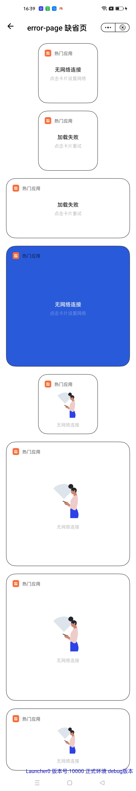

## 缺省页 error

### 描述

缺省页，异常结果页面。

### 使用效果

<div style="text-align: center;margin: 40px;"></div>

### 使用方法

在`.ux`文件中引入组件

```html
<import name="widget-title" src="../../components/title/index.ux"></import>
<import
  name="widget-error-page"
  src="../../components/error-page/index.ux"
></import>
```

### 示例

```html
<template>
  <div class="page">
    <div class="item-container">
      <div class="small-wrapper container">
        <widget-error-page
          is-dark="{{ isDark }}"
          title="无网络连接"
          description="点击卡片设置网络"
        >
          <widget-title is-dark="{{ isDark }}" title="热门应用">
            <div class="logo" enablenightmode="false"></div>
          </widget-title>
        </widget-error-page>
      </div>
    </div>
    <div class="item-container">
      <div class="small-wrapper container">
        <widget-error-page
          is-dark="{{ isDark }}"
          title="加载失败"
          description="点击卡片重试"
        >
          <widget-title is-dark="{{ isDark }}" title="热门应用">
            <div class="logo" enablenightmode="false"></div>
          </widget-title>
        </widget-error-page>
      </div>
    </div>
    <div class="item-container">
      <div class="medium-wrapper container">
        <widget-error-page
          is-dark="{{ isDark }}"
          title="加载失败"
          description="点击卡片重试"
        >
          <widget-title is-dark="{{ isDark }}" title="热门应用">
            <div class="logo" enablenightmode="false"></div>
          </widget-title>
        </widget-error-page>
      </div>
    </div>
    <div class="item-container">
      <div class="large-wrapper container" style="background-color: #295ad9">
        <widget-error-page
          is-dark="{{ isDark }}"
          type="large"
          title="无网络连接"
          title-color="rgba(255, 255, 255, 0.85)"
          description="点击卡片设置网络"
          description-color="rgba(255, 255, 255, 0.3)"
        >
          <widget-title is-dark="{{ isDark }}" title="热门应用">
            <div class="logo" enablenightmode="false"></div>
          </widget-title>
        </widget-error-page>
      </div>
    </div>

    <div class="item-container">
      <div class="small-wrapper container">
        <widget-error-page
          is-dark="{{ isDark }}"
          type="small"
          has-image="{{ true }}"
          description="无网络连接"
        >
          <widget-title is-dark="{{ isDark }}" title="热门应用">
            <div class="logo" enablenightmode="false"></div>
          </widget-title>
          <div slot="image" class="image" enablenightmode="false"></div>
        </widget-error-page>
      </div>
    </div>

    <div class="item-container">
      <div class="large-wrapper container">
        <widget-error-page
          is-dark="{{ isDark }}"
          type="large"
          has-image="{{ true }}"
          description="无网络连接"
        >
          <widget-title is-dark="{{ isDark }}" title="热门应用">
            <div class="logo" enablenightmode="false"></div>
          </widget-title>
          <div slot="image" class="image" enablenightmode="false"></div>
        </widget-error-page>
      </div>
    </div>

    <div class="item-container">
      <div class="medium-wrapper container">
        <widget-error-page
          is-dark="{{ isDark }}"
          type="medium"
          has-image="{{ true }}"
          description="无网络连接"
        >
          <widget-title is-dark="{{ isDark }}" title="热门应用">
            <div class="logo" enablenightmode="false"></div>
          </widget-title>
          <div slot="image" class="image" enablenightmode="false"></div>
        </widget-error-page>
      </div>
    </div>
  </div>
</template>

<script>
  import hot from '../../common/images/hot.png'
  export default {
    data() {
      return {
        hotAppIcon: hot,
        isDark: false,
      }
    },
  }
</script>

<style lang="less">
  @import '../../common/style/common.css';

  .page {
    flex-direction: column;
  }

  .logo {
    width: 100%;
    height: 100%;
    background-image: url('../../common/images/hot.png');
  }

  .image {
    width: 100%;
    height: 100%;
    background-image: url('../../common/images/no-network.png');
  }
</style>
```

### API

#### Attributes

| 属性             | 类型    | 默认值                | 说明                                                                                                |
| ---------------- | ------- | --------------------- | --------------------------------------------------------------------------------------------------- |
| isDark           | Boolean | false                 | 是否是暗色模式                                                                                      |
| type             | String  | -                     | 卡片类型，可选值有 `small` `medium` `large` (分别对应 `2x2(158*158)` `2x4(328*158)` `4x4(328*328)`) |
| title            | String  | -                     | 缺省标题                                                                                            |
| titleColor       | String  | 'rgba(0, 0, 0, 0.85)' | 缺省标题文字颜色                                                                                    |
| description      | String  | -                     | 描述文字                                                                                            |
| descriptionColor | String  | 'rgba(0, 0, 0, 0.3)'  | 描述文字颜色                                                                                        |
| hasImage         | Boolean | false                 | 是否有缺省图，与 title 互斥                                                                         |

#### slot

| 名称    | 描述           |
| ------- | -------------- |
| default | 缺省页头部内容 |
| image   | 缺省图         |
