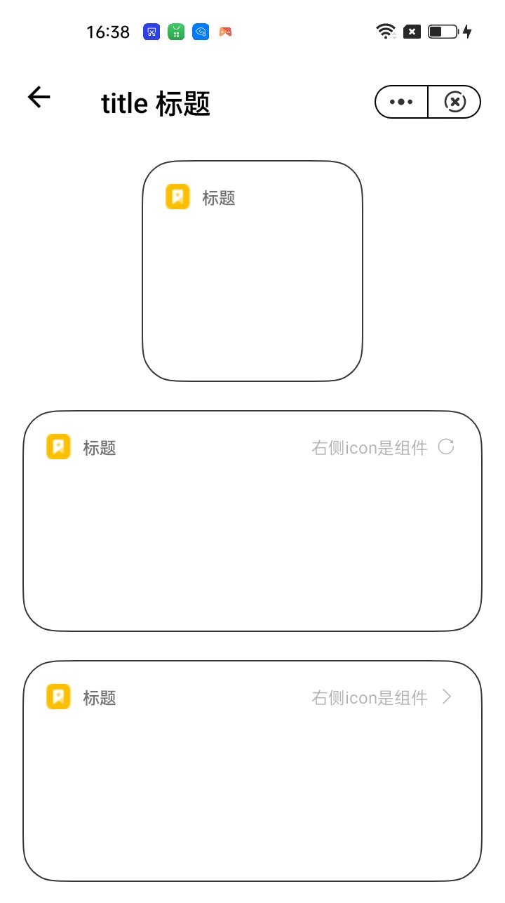

## 标题 title

### 描述

卡片标题组件。

### 使用效果

<div style="text-align: center;margin: 40px;"></div>

### 使用方法

在`.ux`文件中引入组件

```html
<import name="widget-title" src="../../components/title/index.ux"></import>
```

### 示例

```html
<template>
  <div class="page">
    <div class="item-container">
      <div class="small-wrapper container">
        <widget-title title="标题" is-dark="{{ isDark }}">
          <div class="logo" enablenightmode="false"></div>
        </widget-title>
      </div>
    </div>

    <div class="item-container">
      <div class="medium-wrapper container">
        <widget-title
          title="标题"
          right-text="右侧icon是组件"
          is-dark="{{ isDark }}"
          right-icon="refresh"
          @right-click="refreshClick"
        >
          <div class="logo" enablenightmode="false"></div>
        </widget-title>
      </div>
    </div>

    <div class="item-container">
      <div class="medium-wrapper container">
        <widget-title
          title="标题"
          right-text="右侧icon是组件"
          right-icon="forward-arrow"
          is-dark="{{ isDark }}"
          @right-click="moreClick"
        >
          <div class="logo" enablenightmode="false"></div>
        </widget-title>
      </div>
    </div>

    <div class="item-container">
      <div class="large-wrapper container">
        <widget-title
          title="标题"
          right-text="右侧icon是图片"
          has-right-image="{{ true }}"
          is-dark="{{ isDark }}"
        >
          <div class="logo" enablenightmode="false"></div>
          <div
            slot="right-image"
            class="right-image"
            enablenightmode="false"
          ></div>
        </widget-title>
      </div>
    </div>
  </div>
</template>

<script>
  /**
   * @file 标题组件示例
   */

  export default {
    data() {
      return {
        isDark: false,
      }
    },
    refreshClick() {
      console.log('点击刷新!')
    },
    moreClick() {
      console.log('点击更多!')
    },
  }
</script>

<style lang="less">
  @import '../../common/style/common.css';

  .page {
    flex-direction: column;
  }

  .logo {
    width: 100%;
    height: 100%;
    background-image: url('../../common/images/icon.png');
  }

  .right-image {
    width: 100%;
    height: 100%;
    background-image: url('../../common/images/light-more.png');
  }
</style>
```

### API

#### Attributes

| 属性           | 类型    | 默认值    | 说明                                          |
| -------------- | ------- | --------- | --------------------------------------------- |
| isDark         | Boolean | false     | 是否是暗色模式                                |
| title          | String  | -         | 标题                                          |
| color          | String  | '#FFFFFF' | 标题文字颜色                                  |
| rightText      | String  | -         | 右侧按钮文字                                  |
| rightTextColor | String  | -         | 右侧按钮文字颜色                              |
| rightIcon      | String  | -         | 右侧按钮 icon                                 |
| rightIconSize  | Number  | 14        | 右侧按钮 icon 大小                            |
| rightIconColor | String  | -         | 右侧按钮 icon 颜色                            |
| hasRightImage  | Boolean | -         | 右侧按钮是否使用图片代替 icon，配合 slot 使用 |

#### Events

| 事件名称   | 事件描述     | 返回值 |
| ---------- | ------------ | ------ |
| rightClick | 右侧按钮点击 | -      |

#### Slot

| 名称        | 描述                                                                  |
| ----------- | --------------------------------------------------------------------- |
| default     | 标题左侧区域，一般是 logo                                             |
| right-image | 右侧按钮不使用 icon 时，可以使用图片，当 hasRightImage 为 true 时有效 |
